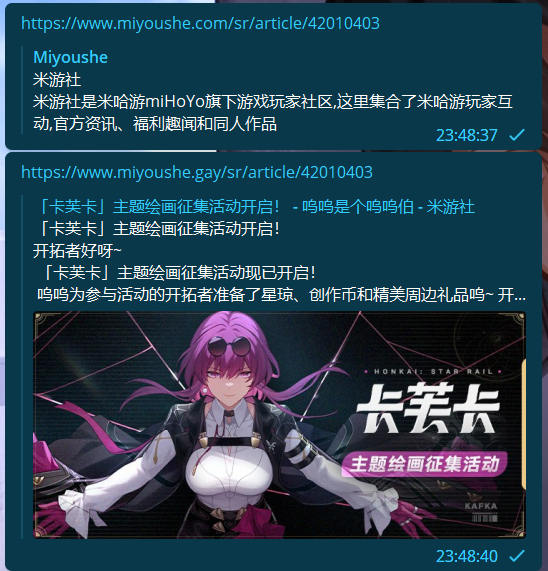
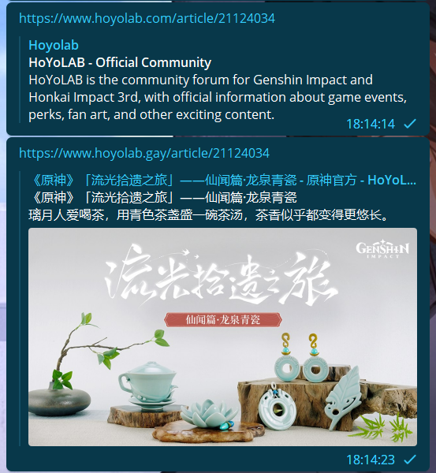

# FixMiYouShe

Embed MiYouShe posts, videos, polls, and more on Telegram

![][icons]

[![License][licensebadge]][license]

<!-- Links & Badges -->

[icons]: https://skillicons.dev/icons?i=py,fastapi,idea
[license]: https://github.com/PaiGramTeam/FixMiYouShe/blob/main/LICENSE.md
[licensebadge]: https://img.shields.io/github/license/PaiGramTeam/FixMiYouShe

# Quick Start

Change `www.miyoushe.com` to `www.miyoushe.gay` in your link

Change `www.hoyolab.com` to `www.hoyolab.gay` in your link

`https://www.miyoushe.com/sr/article/42010403` to `https://www.miyoushe.gay/sr/article/42010403`

`https://www.hoyolab.com/article/21124034` to `https://www.hoyolab.gay/article/21124034`

# Features

- [x] Embed articles
- [x] i18n

# i18n

## language code

| language | code |
| -------- |------|
| English  | en   |
| 简体中文 | 置空   |
| 繁體中文 | tw   |
| 日本語   | ja   |
| 한국어   | ko   |
| Français | fr   |
| Deutsch  | de   |
| Italiano | it   |
| Español  | es   |
| Português| pt   |
| Pусский  | ru   |
| Indonesia| id   |
| ไทย     | th   |
| Türkçe   | tr   |
| Việt Nam | vi   |

## example

`https://www.hoyolab.com/article/21124034` to `https://www.hoyolab.gay/article/21124034/en`

# FAQ

## Why use this?

Because the MiYouShe website used vue.js to render the page, and the telegram can't parse it.

## Why telegram parse so long?

Telegram caches the embeds, so it might take a while for the embed to show up.
